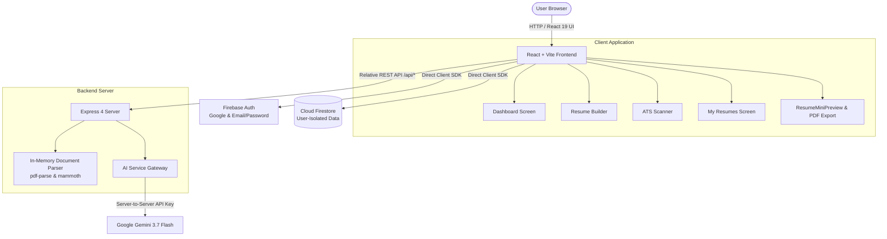

# AI Resume Studio

> **AI-powered Resume Builder & ATS Optimization Platform**

[](https://ai-resume-studio-feyx.onrender.com/)
[](https://github.com/Shivanshu26-bit/ai-resume-studio)
[](https://www.typescriptlang.org/)
[](https://react.dev/)
[](https://tailwindcss.com/)
[](https://expressjs.com/)
[](https://firebase.google.com/)
[](https://ai.google.dev/)
[](LICENSE)

---

## 🌐 Live Deployment & Repository

- 🚀 **Live Demo**: [https://ai-resume-studio-feyx.onrender.com/](https://ai-resume-studio-feyx.onrender.com/)
- 📂 **GitHub Repository**: [https://github.com/Shivanshu26-bit/ai-resume-studio](https://github.com/Shivanshu26-bit/ai-resume-studio)

*AI Resume Studio is actively deployed on Render as a unified full-stack web service.*

---

## 📌 Table of Contents

- [Why AI Resume Studio?](#-why-ai-resume-studio)
- [Product Workflow](#-product-workflow)
- [Key Features](#-key-features)
- [Multilingual & Industry-Aware AI](#-multilingual--industry-aware-ai)
- [Industry-Aware Intelligence](#-industry-aware-intelligence)
- [Non-Hallucination & AI Factuality Safeguards](#-non-hallucination--ai-factuality-safeguards)
- [Live Resume Mini Previews](#-live-resume-mini-previews)
- [System Architecture](#-system-architecture)
- [Technology Stack](#-technology-stack)
- [Backend API Reference](#-backend-api-reference)
- [Local Development Setup](#-local-development-setup)
- [Production Build & Docker](#-production-build--docker)
- [Security & Privacy Model](#-security--privacy-model)
- [Screenshots & UI Showcase](#-screenshots--ui-showcase)
- [Current Implementation Status](#-current-implementation-status)
- [Future Roadmap](#-future-roadmap)
- [What This Project Demonstrates](#-what-this-project-demonstrates)
- [Author & License](#-author--license)

---

## 💡 Why AI Resume Studio?

Most traditional resume builders force job seekers to manually fill dozens of repetitive form fields and optimize their experience based solely on generic software-industry assumptions. Meanwhile, standard AI text generators frequently fabricate metrics, invent unearned seniorities, and hallucinate tools that candidates never used.

**AI Resume Studio** solves these issues through a unified, privacy-conscious workflow:
- **Build from scratch or upload** existing PDF, DOCX, or text resumes with automatic field extraction.
- **Review extracted data** before populating the builder so the user maintains complete editorial control.
- **Understand language & domain context** across diverse Indian and global professions (Teaching, Healthcare, Accounting/GST, Sales, Engineering, IT).
- **Receive objective AI suggestions** strictly framed as recommendations (*"Consider adding this if applicable"*) without inventing fake credentials or statistics.
- **Scan against actual Job Descriptions** to identify present vs. missing keywords with realistic ATS readiness estimates.
- **Export clean, multi-page A4 PDFs** formatted across 4 typography templates with zero layout distortion.

> **Core Product Philosophy**: *Build, Import, Improve, ATS-Optimize, and Export your resume.*

---

## 🔄 Product Workflow

### 1. Existing Document Import Flow
```
Upload PDF / DOCX / TXT Resume
              ↓
Transient Server-side Text Parsing (in-memory, no cloud storage)
              ↓
Gemini AI Extracts Structured Sections (Personal, Experience, Education, Skills)
              ↓
Review Extracted Data Modal (Inspect and Edit before Applying)
              ↓
Populates Resume Builder
              ↓
AI Content Improvement & Domain Context Alignment
              ↓
ATS Scanner & Job Description Keyword Match
              ↓
High-Resolution Multi-Page A4 PDF Export
```

### 2. Scratch Creation Flow
```
Create Blank Resume
              ↓
Select Template (Modern • Classic • Minimal • Executive)
              ↓
Fill Structured Sections with Live Preview
              ↓
Use AI Assistants (Summary Generator • STAR Bullet Enhancer • Project Optimizer)
              ↓
ATS Scan & Keyword Alignment Check
              ↓
Download Clean A4 PDF
```

---

## 🚀 Key Features

### 1. 📝 AI Resume Builder
- **Multi-Section Editing**: Real-time management for Personal Details, Professional Summary, Work Experience, Education, Skills, Technical Projects, Certifications, and Custom Sections.
- **4 Typography Themes**:
  - **Modern**: Clean left-accent indigo layout optimized for tech and corporate roles.
  - **Classic**: Formal serif typography with traditional horizontal rules suited for academia and law.
  - **Minimal**: High-density, elegant mono-accented layout maximizing content space.
  - **Executive**: Dark header band with two-column balance designed for leadership and management.
- **AI Writing Assistants**:
  - **Summary Generator**: Crafts role-tailored summaries based strictly on candidate qualifications.
  - **STAR Bullet Enhancer**: Refines raw bullet points into *Situation, Task, Action, Result* formats.
  - **Project Enhancer**: Highlights technical architecture, frameworks, and measurable outcomes.
- **Explicit Apply/Accept Workflow**: AI suggestions are presented side-by-side with original text; changes are never applied without explicit user approval.
- **Cloud Auto-Sync**: Real-time persistence with Cloud Firestore.

### 2. 📄 Resume Import & Transient Document Extraction
- **Supported Formats**: `.pdf` (via `pdf-parse`), `.docx` (via `mammoth`), and `.txt` plain text files.
- **Transient In-Memory Processing**: Uploaded documents are parsed in memory on the server and never written to permanent cloud storage.
- **Structured Field Extraction**: Accurately maps contact details, employment history, education credentials, and core competencies into typed resume structures.
- **Extraction Review Modal**: Candidates can review, edit, and approve extracted information before populating their resume canvas.

### 3. 🎯 ATS Readiness Scanner & Keyword Gap Analysis
- **Comprehensive ATS Readiness Score**: Calculates an overall compatibility score (0–100%) across Keyword Match, Skills Match, Title Alignment, Experience Depth, Education Alignment, and Formatting Readability.
- **Present vs. Suggested Keywords**:
  - **Matched Keywords**: Skills and concepts verified in candidate data.
  - **Missing Recommended Keywords**: Suggested industry competencies to consider adding *only if legitimately possessed*.
- **Job Description Analysis**: Paste any real-world job posting to compute tailored keyword density and requirement alignment.
- **Direct "Improve Resume" Action**: Seamlessly jump from the ATS audit back to the Builder to address identified gaps.

> *Note: ATS scores in AI Resume Studio are AI-generated readiness estimates designed for educational improvement, not official scores from proprietary commercial ATS software.*

### 4. 🖨️ High-Fidelity A4 Multi-Page PDF Export
- Client-side vector-accurate compilation powered by `html2canvas` and `jspdf`.
- Dynamic multi-page height calculation with page-break awareness to prevent split text or orphaned headers.
- Exported filenames automatically generated from candidate name and target role (e.g., `Alex_Chen_Software_Engineer_Resume.pdf`).

### 5. 📂 My Resumes Workspace
- Dedicated workspace displaying all user resumes synced from Cloud Firestore.
- Features **Live A4 Thumbnail Previews** displaying the selected template's exact layout.
- One-click actions to **Edit**, **Run ATS Scan**, **Export PDF**, **Duplicate**, or **Delete**.
- Live search and filtering by ATS score tier (*All*, *High ATS ≥80%*, *Needs Work <80%*).

### 6. 📊 Intuitive Dashboard
- Dynamic greeting with workspace overview and cloud synchronization indicators.
- Major entry cards for the **Resume Builder** and **ATS Scanner**.
- **AI Quick Tools**: One-tap access to *Improve Resume*, *Analyze Job*, and *Upload Resume*.
- **Recent Activity Feed**: Real-time logs of updated and saved resumes.

---

## 🌏 Multilingual & Industry-Aware AI

AI Resume Studio is engineered to support candidates across Indian and global linguistic and career contexts.

### Supported Languages
The platform supports language and terminology recognition across:
- **Hindi (हिन्दी)**
- **Bengali (বাংলা)**
- **Telugu (తెలుగు)**
- **Marathi (मराठी)**
- **Tamil (தமிழ்)**
- **Gujarati (ગુજરાતી)**
- **Kannada (ಕನ್ನಡ)**
- **Malayalam (മലയാളം)**
- **Odia (ଓଡ଼ିଆ)**
- **Punjabi (ਪੰਜਾਬੀ)**
- **Assamese (অসমীয়া)**
- **English**

### Semantic Understanding vs. Literal Translation
Rather than performing rigid word-for-word translation, the AI interprets semantic domain concepts:
- Hindi: *"कक्षा प्रबंधन"* → Interpreted as *Classroom Management & Pedagogy*
- Hindi: *"लेखांकन एवं जीएसटी"* → Interpreted as *Accounting, Ledger Maintenance & GST Compliance*
- Hindi: *"रोगी देखभाल"* → Interpreted as *Patient Care & Nursing Protocols*
- Resumes featuring mixed English/Hindi vocabulary (code-switching) are parsed smoothly.

---

## 🏢 Industry-Aware Intelligence

The platform tailors its ATS scoring and suggestions according to the candidate's actual industry domain:

| Domain | Representative Contextual Competencies |
| :--- | :--- |
| **Education / Teaching** | Lesson Planning, Pedagogy, Classroom Management, Student Assessment, CBSE/State Curriculum |
| **Healthcare / Nursing** | Patient Care, Clinical Protocols, Vital Monitoring, Triage, ICU/Ward Management |
| **Finance & Taxation** | Ledger Maintenance, Financial Reporting, Tally/ERP, GST Compliance (GSTR-1/3B), Auditing |
| **IT & Software** | Full-Stack Development, REST APIs, CI/CD, Cloud Architecture, System Design |
| **Sales & Business** | Client Relationship Management, Lead Generation, Pipeline Management, B2B Sales |
| **Engineering** | Technical Design, Quality Assurance, CAD/CAM, Maintenance & Safety Standards |
| **Retail & Hospitality** | Guest Relations, Inventory Management, POS Operations, Service Quality |

---

## 🛡️ Non-Hallucination & AI Factuality Safeguards

Generative AI in AI Resume Studio is strictly bounded by deterministic anti-hallucination guardrails:

1. **Zero Invented Experience**: The AI will never generate fictitious employers, dates of employment, degrees, or job titles.
2. **Zero Fabricated Metrics**: The model is forbidden from inventing fake revenue numbers, student counts, or percentages. When a metric would improve a bullet point, it uses bracketed suggestions (e.g., `"[Consider adding specific batch size or pass rate if verified]"`).
3. **Suggestion-Only Framing**: Missing tools or licenses (such as CTET, B.Ed, KNC, Tally Prime, or AWS) are presented as suggestions to consider *only if legitimately held*, never as declarative resume claims.
4. **Structured JSON Schemas**: All Gemini API calls use strict response schemas (`Type.OBJECT`, `Type.ARRAY`) preventing unformatted or ambiguous AI output.

---

## 🖼️ Live Resume Mini Previews

The `ResumeMiniPreview` component dynamically renders scaled A4 miniature visual thumbnails for every saved resume:
- Reflects the selected theme's visual signature (indigo accent bar for Modern, serif centered rules for Classic, clean lines for Minimal, dark header for Executive).
- Displays actual candidate initials/name, target role, and real skill tags.
- Allows candidates to visually recognize their documents instantly on the Dashboard and My Resumes screens.

---

## 🏗️ System Architecture



### Architectural Highlights
- **Unified Full-Stack Container**: Express serves the compiled Vite SPA from `dist/` and hosts the `/api/*` routes on port 3000, eliminating CORS issues and cross-origin latency.
- **Zero Client-Side AI Keys**: The `GEMINI_API_KEY` is maintained strictly server-side.
- **Transient Memory Parsing**: Resume files uploaded for extraction are parsed directly in RAM buffers and discarded immediately.

---

## 🛠️ Technology Stack

| Category | Technology | Usage in AI Resume Studio |
| :--- | :--- | :--- |
| **Frontend** | React 19, TypeScript 5.8 | Component hierarchy, state management, and typed data flows |
| **Build & Tooling** | Vite 6, tsx, esbuild | Instant development server and production CJS server bundler |
| **Styling** | Tailwind CSS v4 | Responsive utility classes and design system |
| **Icons & UI** | Lucide React | Modern vector iconography |
| **PDF Generation** | jsPDF, html2canvas | Vector-accurate client-side A4 multi-page document export |
| **Backend** | Express 4, Node.js | REST API routing, static bundle serving, and middleware |
| **Document Parsing** | pdf-parse, mammoth | In-memory extraction of text from PDF and DOCX uploads |
| **AI Engine** | Google Gemini 3.7 Flash (`@google/genai`) | Structured content generation, summary refinement, and ATS audits |
| **Database** | Cloud Firestore | Real-time multi-resume synchronization with zero-trust security rules |
| **Authentication** | Firebase Authentication | Google OAuth 2.0 and Email/Password sign-in |
| **Containerization** | Docker | Multi-stage production containerization |
| **Deployment** | Render | Hosted web service deployment |

---

## 📡 Backend API Reference

All backend routes are served under the `/api` prefix.

### Health & Diagnostics
- `GET /api/health`
  - Returns `{"status": "ok"}` for service health checks.

### AI Endpoints
- `POST /api/ai/upload-extract`
  - Accepts a base64 encoded document buffer (`application/pdf`, `.docx`, `.txt`) and returns extracted structured resume fields.
- `POST /api/ai/parse-draft`
  - Parses unstructured text into structured JSON fields (personal, experiences, education, skills, industry classification).
- `POST /api/ai/generate-summary`
  - Generates a 2–3 sentence factual professional summary aligned with target role, industry, and preferred language.
- `POST /api/ai/improve-content`
  - Refines raw bullet points into STAR-format achievement statements with 3 distinct variations.
- `POST /api/ai/improve-project`
  - Enhances portfolio project descriptions with architectural tags and implementation outcomes.
- `POST /api/ai/analyze-job`
  - Compares resume data against target job description text to extract matched vs. missing keywords.
- `POST /api/ai/ats-analysis`
  - Runs a comprehensive ATS scoring audit returning readiness percentage, category breakdowns, and suggestions.

---

## 💻 Local Development Setup

### Prerequisites
- **Node.js**: `v20.x` or higher
- **npm**: `v10.x` or higher
- **Gemini API Key**: From [Google AI Studio](https://aistudio.google.com/)
- **Firebase Project**: Configured with Authentication and Cloud Firestore

### 1. Clone the Repository
```bash
git clone https://github.com/Shivanshu26-bit/ai-resume-studio.git
cd ai-resume-studio
```

### 2. Install Dependencies
```bash
npm install
```

### 3. Configure Environment Variables
Create a local `.env` file in the root directory:
```bash
cp .env.example .env
```

Populate `.env` with your credentials:
```env
# ==========================================
# SERVER-SIDE ONLY (Private)
# ==========================================
GEMINI_API_KEY=your_gemini_api_key_here
PORT=3000
NODE_ENV=development

# ==========================================
# CLIENT-SIDE (Firebase Web SDK Config)
# ==========================================
VITE_FIREBASE_API_KEY=AIzaSy...
VITE_FIREBASE_AUTH_DOMAIN=your-project.firebaseapp.com
VITE_FIREBASE_PROJECT_ID=your-project-id
VITE_FIREBASE_STORAGE_BUCKET=your-project.firebasestorage.app
VITE_FIREBASE_MESSAGING_SENDER_ID=123456789
VITE_FIREBASE_APP_ID=1:123456789:web:abcdef
VITE_FIREBASE_FIRESTORE_DATABASE_ID=(default)
```

### 4. Start Development Server
```bash
npm run dev
```
Open [http://localhost:3000](http://localhost:3000) in your browser.

### 5. Type Checking
```bash
npm run lint
```

---

## 📦 Production Build & Docker

### Standard Build
```bash
# 1. Compile Vite frontend and bundle server.ts to dist/server.cjs
npm run build

# 2. Launch production Node.js server
npm start
```

### Local Docker Build & Run
```bash
# Build Docker image
docker build -t ai-resume-studio .

# Run container locally
docker run -p 3000:3000 \
  -e GEMINI_API_KEY="your_gemini_api_key" \
  -e NODE_ENV="production" \
  ai-resume-studio
```

---

## 🔒 Security & Privacy Model

- **Zero Client-Side AI Credentials**: The Gemini API key is isolated strictly within backend routines.
- **User Document Isolation**: Cloud Firestore enforces strict owner-only read/write rules based on authenticated Firebase UIDs.
- **Transient Document Processing**: Uploaded PDF and DOCX files are decoded and parsed entirely in memory; raw files are never stored in Firebase Storage or database records.
- **Repository Hygiene**: Environment files (`.env`), build artifacts (`dist/`), and credentials are systematically excluded via `.gitignore` and `.dockerignore`.

---

## 📸 Screenshots & UI Showcase

*Below are representative visual layouts from AI Resume Studio:*

### Dashboard & Quick Actions
> *The modern SaaS home screen with personalized greetings, quick AI tools, industry intelligence banner, and active resume overview.*

### Resume Builder & Live Preview
> *Structured multi-section resume editor with live A4 document rendering, template toggles, and integrated AI writing assistants.*

### ATS Compatibility Scanner
> *Factual ATS readiness assessment with keyword matching gauge, category score breakdown, and suggested additions.*

### Resume Import & Review
> *Drag-and-drop PDF/DOCX resume uploader with instant in-memory field extraction and pre-import review modal.*

### My Resumes Workspace
> *Cloud workspace showcasing live A4 thumbnail previews, search filtering, and one-click PDF export.*

---

## 📊 Current Implementation Status

- [x] Firebase Authentication (Google Sign-In & Email/Password)
- [x] Cloud Firestore real-time persistence with user isolation
- [x] 4 Professional Typography Templates (Modern, Classic, Minimal, Executive)
- [x] Drag-and-drop resume upload for PDF, DOCX, and TXT
- [x] In-memory server-side document parsing
- [x] Pre-import extraction review modal
- [x] Multilingual intelligence across 12 Indian languages
- [x] Industry-aware domain context (Education, Healthcare, Finance, Tech, etc.)
- [x] Strict anti-hallucination guardrails & factuality enforcement
- [x] ATS Scanner with keyword matching & category breakdowns
- [x] Job Description comparative analysis
- [x] STAR-method experience bullet enhancer
- [x] Technical project optimizer
- [x] Professional summary generator
- [x] Live A4 miniature thumbnails (`ResumeMiniPreview`)
- [x] High-DPI multi-page A4 PDF export
- [x] Responsive desktop, tablet, and mobile navigation
- [x] Dockerfile & Render production deployment

---

## 🔮 Future Roadmap

- [ ] **Targeted Cover Letter Generator**: Generate job-specific cover letters aligned with the analyzed resume.
- [ ] **Native DOCX Export**: Provide Microsoft Word `.docx` downloads alongside PDF exports.
- [ ] **Resume Version History**: Snapshot and restore earlier iterations of saved resumes.
- [ ] **Interactive Interview Preparation**: Generate practice interview questions derived from the candidate's resume and target role.

---

## 🎓 What This Project Demonstrates

Built as a capstone software engineering project, **AI Resume Studio** demonstrates:
- **Full-Stack Architecture**: Integrating a React 19 single-page application with an Express API gateway.
- **Applied AI Engineering**: Designing deterministic JSON schemas, context-aware prompt templates, and anti-hallucination guardrails with Google Gemini 3.7 Flash.
- **Multilingual NLP**: Semantic terminology parsing across regional Indian languages and profession-specific standards.
- **Document Processing**: In-memory binary buffer handling for PDF and DOCX extraction.
- **Cloud Data Modeling**: Real-time NoSQL synchronization and access control rules in Firebase Firestore.
- **Client-Side Document Compilation**: Multi-page PDF generation with dynamic page-break calculation.
- **DevOps & Production Readiness**: Containerization with Docker and automated deployment on Render.

---

## 👤 Author

**Shivanshu Shukla**  
*BCA — Artificial Intelligence & Data Science*  
GitHub: [@Shivanshu26-bit](https://github.com/Shivanshu26-bit)

---

## 📄 License

This project is licensed under the [MIT License](LICENSE).
